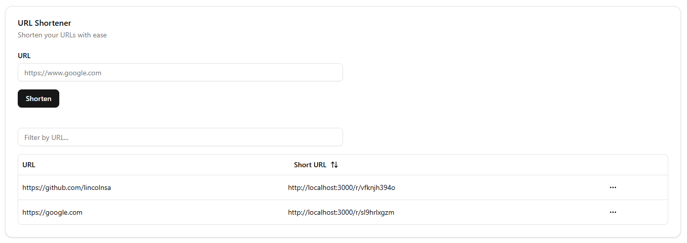

<p align="center">
  <h1>Short URL</h1>
</p>

<p align="center">
  <a href="#-projeto">Projeto</a>&nbsp;&nbsp;&nbsp;|&nbsp;&nbsp;&nbsp;
  <a href="#-tecnologias">Tecnologias</a>&nbsp;&nbsp;&nbsp;|&nbsp;&nbsp;&nbsp;
  <a href="#-layout">Layout</a>&nbsp;&nbsp;&nbsp;|&nbsp;&nbsp;&nbsp;
  <a href="#-instalacao">Instalação</a>
</p>

<br>

<p align="center">
  
</p>

## 💻 Projeto
O Short URL é uma aplicação web que permite encurtar URLs longas em links mais curtos e gerenciáveis. Com uma interface intuitiva e moderna, os usuários podem facilmente:

- Encurtar qualquer URL longa em segundos
- Copiar o link encurtado para a área de transferência
- Gerenciar todos os links encurtados em um dashboard
- Filtrar e ordenar os links por URL
- Excluir links que não são mais necessários

A aplicação foi desenvolvida com foco em usabilidade e performance, utilizando as melhores práticas e tecnologias modernas do ecossistema React/Next.js.

 
## 🚀 Tecnologias

Esse projeto foi desenvolvido com as seguintes tecnologias:

- TypeScript
- Next.js
- Tailwind CSS
- React Hook Form
- Shadcn/ui
- Zod
- TanStack Query
- Lucide React
- Docker
- Axios
- Redis 

## Instalação

1. Clone o repositório
2. Instale as dependências
3. Configure o arquivo .env
4. Execute o projeto

```bash
yarn
yarn dev
```

---

Feito com ♥ by Lincoln Setúbal

- [Instagram](https://www.instagram.com/lincolnsetubal/)
- [Github](https://github.com/LincolnSA)
- [Portfólio](https://lincolnsa.github.io/)